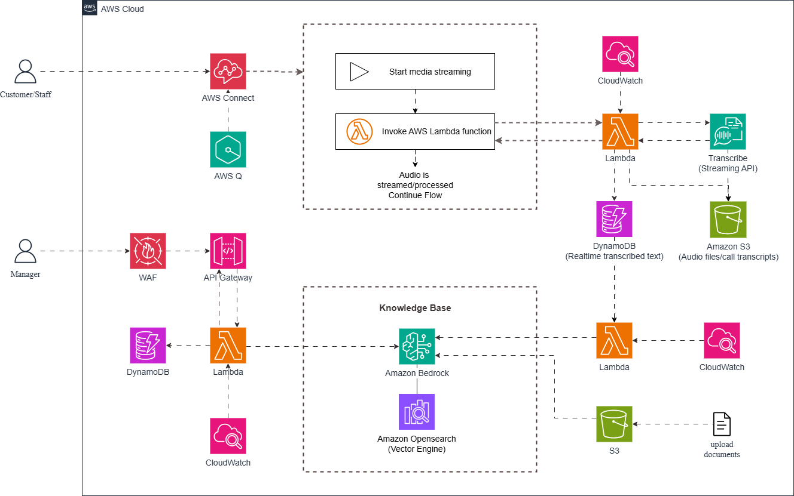
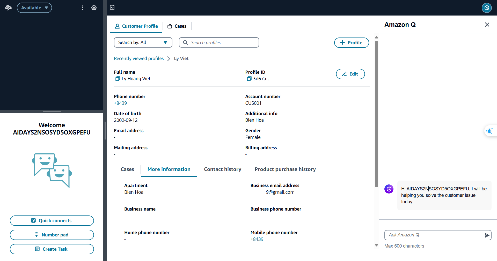
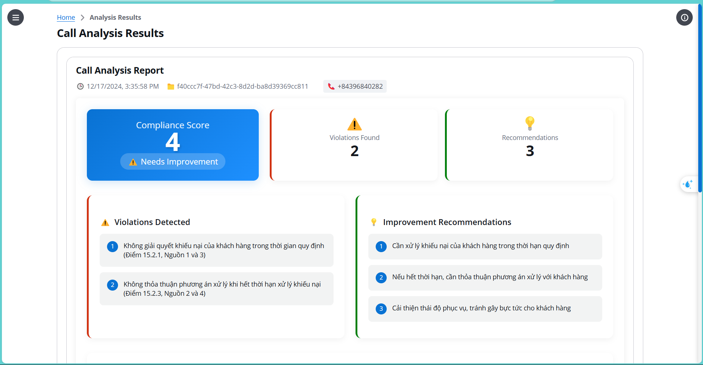
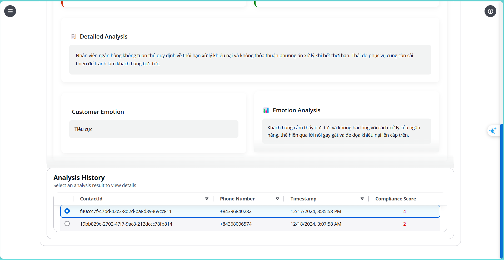

# AI-Powered Call Center Compliance Evaluation

An intelligent solution leveraging AWS services to automate compliance monitoring and enhance customer experience in banking call centers. This project combines Amazon Connect, Amazon Transcribe, and Amazon Bedrock to create a comprehensive system for analyzing customer interactions and ensuring regulatory compliance.

## 🎯 Overview

This project provides an AI-powered solution for:
- Real-time compliance monitoring of customer service calls
- Automated transcription and analysis of conversations
- Sentiment analysis and customer satisfaction tracking
- Enhanced operational efficiency for banking employees

## 🏗️ Architecture

The system architecture integrates three main AWS services:

1. **Amazon Connect**
   - Handles real-time call management
   - Stores voice recordings
   - Manages customer profiles
   - Integrates with Amazon Q for agent assistance

2. **Amazon Transcribe**
   - Converts call audio to text
   - Enables detailed conversation analysis
   - Provides accurate transcription for compliance review

3. **Amazon Bedrock**
   - Analyzes conversation compliance
   - Performs sentiment analysis
   - Generates insights and recommendations

## 🚀 Features

### Core Functionality
- Real-time call monitoring and recording
- Automated compliance checking against banking regulations
- Sentiment analysis and customer satisfaction tracking
- Detailed analytics and reporting dashboard

### Agent Interface

### Analysis Dashboard

## 🎥 Demo

Check out our demonstration video to see the system in action:
[Watch Demo Video](https://drive.google.com/file/d/1xMTGGh_PFU3QWF5ZQDD2Bji6WqcayHfO/view?usp=drive_link)

## 🛠️ Setup and Installation

1. **Prerequisites**
   - AWS Account with appropriate permissions
   - Access to Amazon Connect, Transcribe, and Bedrock services
   - Basic understanding of AWS service configuration

2. **Amazon Connect Setup**
   - Configure Amazon Connect instance
   - Set up call flows and recording
   - Enable customer profiles
   - Integrate Amazon Q

3. **Amazon Transcribe Configuration**
   - Enable real-time transcription
   - Configure language settings
   - Set up custom vocabulary (if needed)

4. **Amazon Bedrock Integration**
   - Set up knowledge base
   - Configure analysis models
   - Enable API access

## 📚 Documentation & Resources

### Amazon Connect
- [Call Flows Documentation](https://docs.aws.amazon.com/connect/)
- [Customer Profile Guide](https://docs.aws.amazon.com/connect/latest/adminguide/customer-profiles.html)
- [Amazon Q Integration](https://docs.aws.amazon.com/connect/latest/adminguide/amazon-q-connect.html)
- [Video Tutorial](https://www.youtube.com/watch?v=yKNb6db_d7c)

### Amazon Transcribe
- [Service Overview](https://www.youtube.com/watch?v=r77sUEEizWQ)

### Amazon Bedrock
- [Getting Started Guide](https://docs.aws.amazon.com/bedrock/latest/userguide/getting-started.html)
- [Knowledge Base Setup](https://docs.aws.amazon.com/bedrock/latest/userguide/knowledge-base-create.html)

## 🔮 Future Development

Planned enhancements include:
- Advanced fraud detection using voice pattern analysis
- Enhanced customer insights through deep learning
- Expanded compliance rule sets
- Integration with additional AWS services

## 🤝 Contributing

We welcome contributions to improve this project. Please:
1. Fork the repository
2. Create a feature branch
3. Submit a pull request with detailed description

## 📜 License

This project is licensed under the MIT License - see the LICENSE file for details.

## 🎖️ Acknowledgments

Developed for HDBank Hackathon 2024

---
